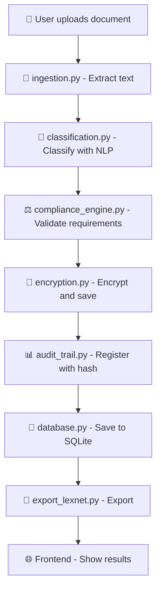

# 📄 Legal Document Classifier

<div align="center">


**Professional system for uploading, classifying and auditing legal documents**

*Combining NLP (Hugging Face), regulatory compliance, audit trail and security with encryption*

[Installation](#-quick-installation) • [Demo](#-quick-demo) • [Documentation](#-api-documentation) • [Contribute](#-contribute)

</div>

---

## 🎯 **Main Features**

- 🤖 **Intelligent Classification** - NLP with Hugging Face models
- 🔒 **Advanced Security** - AES-256 encryption and role control  
- 📋 **Regulatory Compliance** - Automatic document validation
- 🔍 **Complete Audit Trail** - Traceability with chained hash
- 🌐 **Modern Web Interface** - Responsive and intuitive dashboard
- ⚡ **REST API** - Robust endpoints for integrations

---

## 🛠️ **System Requirements**

| Component | Required Version |
|-----------|------------------|
| **Python** | 3.10+ |
| **Pip** | Latest version |
| **OS** | Windows / macOS / Linux |

### 📦 Main Dependencies

```bash
fastapi>=0.104.0
uvicorn[standard]>=0.24.0
transformers>=4.35.0
torch>=2.1.0
PyMuPDF>=1.23.0
docx2txt>=0.8
sqlite-utils>=3.35.0
```

---

## 📁 **Project Architecture**

```
clasificador_docs/
├── 🖥️ back/                          # FastAPI Backend
│   ├── app/
│   │   ├── 📊 audit/                 # Audit system
│   │   │   └── audit_trail.py
│   │   ├── 🧠 classification.py      # NLP engine
│   │   ├── ⚖️ compliance/            # Legal validation
│   │   │   └── compliance_engine.py
│   │   ├── ⚙️ constants.py           # Configuration
│   │   ├── 💾 database.py            # SQLite connection
│   │   ├── 📝 demo_dataset.py        # Test data
│   │   ├── 📄 ingestion.py           # Text extraction
│   │   ├── 🔗 integration/           # Exports
│   │   │   └── export_lexnet.py
│   │   ├── 🚀 main.py                # API endpoints
│   │   ├── 🔍 search.py              # Search engine
│   │   └── 🔐 security/              # Security
│   │       ├── encryption.py
│   │       └── roles.py
│   ├── 📤 uploads/                   # Uploaded files
│   └── 💾 documents.db               # Database
├── 🌐 front/                         # Web frontend
│   └── static/
│       ├── index.html
│       ├── script.js
│       └── style.css
├── 🧪 test/                          # Unit tests
└── ▶️ run_demo.py                    # Demo runner
```

---

## ⚡ **Quick Installation**

### 1️⃣ Clone repository
```bash
git clone https://github.com/yourusername/clasificador_docs.git
cd clasificador_docs/back
```

### 2️⃣ Create virtual environment
```bash
python -m venv .venv

# Windows
.venv\Scripts\activate

# macOS/Linux  
source .venv/bin/activate
```

### 3️⃣ Install dependencies
```bash
pip install -r requirements.txt
```

### 4️⃣ Run server
```bash
python -m uvicorn app.main:app --reload
```

🎉 **Ready!** Access: `http://localhost:8000`

---

## 📚 **API Documentation**

### 🔗 Available Endpoints

| Method | Endpoint | Description | Parameters |
|--------|----------|-------------|------------|
| `POST` | `/load_demo/` | Load demo dataset | - |
| `POST` | `/upload_document/` | Upload and classify document | `file` (PDF/TXT) |
| `GET` | `/list_documents/` | List documents | `category` (optional) |
| `GET` | `/search_documents/` | Search in documents | `query` (required) |

### 📤 **Upload Document**

**Request:**
```bash
POST /upload_document/
Content-Type: multipart/form-data
file: [document.pdf]
```

**Response:**
```json
{
  "success": true,
  "document_id": 1,
  "filename": "contract.pdf",
  "detected_category": "contract",
  "confidence": 0.92,
  "all_scores": [
    ["contract", 0.92],
    ["judgment", 0.05],
    ["regulation", 0.03]
  ],
  "compliance_status": "✅",
  "hash_integrity": "abc123..."
}
```

### 📋 **List Documents**

```bash
GET /list_documents/?category=contract
```

### 🔍 **Search Documents**

```bash
GET /search_documents/?query=signature
```

---

## 🔄 **System Flow**



---

## 🌐 **Frontend Features**

- ✨ **Modern Interface** - Responsive and intuitive design
- 📊 **Interactive Dashboard** - Real-time metrics  
- 🔍 **Advanced Filters** - Search and sorting
- 📈 **Visual Indicators** - Compliance status
- 🔒 **Access Control** - User role permissions
- 📤 **Export** - External system integration

---

## 🔒 **Security and Compliance**

### 🛡️ Security Measures

| Feature | Implementation |
|---------|----------------|
| **Encryption** | AES-256 for files |
| **Access Control** | Roles: Senior/Junior Auditor, User |
| **Audit Trail** | Chained hash (blockchain-style) |
| **Integrity** | SHA-256 verification |

### ⚖️ Legal Validation

- ✅ **Contracts** - Essential clauses verification
- ⚖️ **Judgments** - Valid judicial structure  
- 📜 **Regulations** - Correct regulatory format

---

## 💡 **Differentiating Features**

🔥 **Unique Characteristics:**

- 🔗 **Mini Blockchain** - Immutable history with chained hash
- 🤖 **Specialized AI** - Models trained for legal documents
- 🏛️ **LexNet Integration** - Simulated export to judicial systems
- 📊 **Control Room** - Executive dashboard with ROI metrics
- 🔍 **Semantic Search** - Intelligent content analysis

---

## 🧪 **Testing**

Run complete tests:

```bash
# All tests
python -m pytest test/

# Specific test
python -m pytest test/test_classification.py -v

# Coverage
python -m pytest --cov=app test/
```

### 📋 Test Coverage

- ✅ Text extraction (`extract_text_from_file()`)
- ✅ NLP classification (`classify_text()`)  
- ✅ Compliance validation
- ✅ Security and encryption
- ✅ Audit trail

---

## 🚀 **Quick Demo**

### 1. Load demo data
```bash
curl -X POST http://localhost:8000/load_demo/
```

### 2. Upload a document
```bash
curl -X POST "http://localhost:8000/upload_document/" \
  -F "file=@document.pdf"
```

### 3. List documents
```bash
curl http://localhost:8000/list_documents/
```

### 4. Search by term
```bash
curl "http://localhost:8000/search_documents/?query=contract"
```

---

## 🤝 **Contribute**

1. 🍴 **Fork** the project
2. 🌿 **Create** your feature branch (`git checkout -b feature/AmazingFeature`)
3. 💾 **Commit** your changes (`git commit -m 'Add some AmazingFeature'`)
4. 📤 **Push** to the branch (`git push origin feature/AmazingFeature`)
5. 🔃 **Open** a Pull Request

---

<div align="center">

**⭐ If it has been useful, give the repo a star! ⭐**

*Developed with ❤️ for the legal community*

</div>
