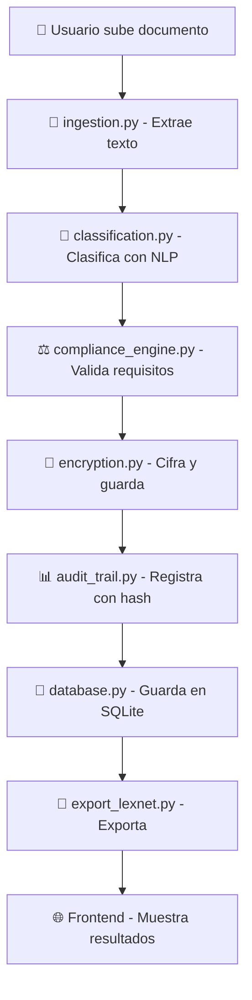

# 📄 Clasificador de Documentos Legales

<div align="center">


**Sistema profesional para subir, clasificar y auditar documentos legales**

*Combinando NLP (Hugging Face), cumplimiento normativo, audit trail y seguridad con cifrado*

[Instalación](#-instalación) • [Demo](#-demo-rápida) • [Documentación](#-documentación-api) • [Contribuir](#-contribuir)

</div>

---

## 🎯 **Características Principales**

- 🤖 **Clasificación Inteligente** - NLP con modelos de Hugging Face
- 🔒 **Seguridad Avanzada** - Cifrado AES-256 y control de roles  
- 📋 **Cumplimiento Normativo** - Validación automática de documentos
- 🔍 **Audit Trail Completo** - Trazabilidad con hash encadenado
- 🌐 **Interfaz Web Moderna** - Dashboard responsive y intuitivo
- ⚡ **API REST** - Endpoints robustos para integraciones

---

## 🛠️ **Requisitos del Sistema**

| Componente | Versión Requerida |
|------------|-------------------|
| **Python** | 3.10+ |
| **Pip** | Última versión |
| **SO** | Windows / macOS / Linux |

### 📦 Dependencias Principales

```bash
fastapi>=0.104.0
uvicorn[standard]>=0.24.0
transformers>=4.35.0
torch>=2.1.0
PyMuPDF>=1.23.0
docx2txt>=0.8
sqlite-utils>=3.35.0
```

---

## 📁 **Arquitectura del Proyecto**

```
clasificador_docs/
├── 🖥️ back/                          # Backend FastAPI
│   ├── app/
│   │   ├── 📊 audit/                 # Sistema de auditoría
│   │   │   └── audit_trail.py
│   │   ├── 🧠 classification.py      # Motor NLP
│   │   ├── ⚖️ compliance/            # Validación legal
│   │   │   └── compliance_engine.py
│   │   ├── ⚙️ constants.py           # Configuración
│   │   ├── 💾 database.py            # Conexión SQLite
│   │   ├── 📝 demo_dataset.py        # Datos de prueba
│   │   ├── 📄 ingestion.py           # Extracción de texto
│   │   ├── 🔗 integration/           # Exportaciones
│   │   │   └── export_lexnet.py
│   │   ├── 🚀 main.py                # API endpoints
│   │   ├── 🔍 search.py              # Motor búsqueda
│   │   └── 🔐 security/              # Seguridad
│   │       ├── encryption.py
│   │       └── roles.py
│   ├── 📤 uploads/                   # Archivos subidos
│   └── 💾 documents.db               # Base de datos
├── 🌐 front/                         # Frontend web
│   └── static/
│       ├── index.html
│       ├── script.js
│       └── style.css
├── 🧪 test/                          # Tests unitarios
└── ▶️ run_demo.py                    # Ejecutor de demo
```

---

## ⚡ **Instalación Rápida**

### 1️⃣ Clonar repositorio
```bash
git clone https://github.com/tuusuario/clasificador_docs.git
cd clasificador_docs/back
```

### 2️⃣ Crear entorno virtual
```bash
python -m venv .venv

# Windows
.venv\Scripts\activate

# macOS/Linux  
source .venv/bin/activate
```

### 3️⃣ Instalar dependencias
```bash
pip install -r requirements.txt
```

### 4️⃣ Ejecutar servidor
```bash
python -m uvicorn app.main:app --reload
```

🎉 **¡Listo!** Accede a: `http://localhost:8000`

---

## 📚 **Documentación API**

### 🔗 Endpoints Disponibles

| Método | Endpoint | Descripción | Parámetros |
|--------|----------|-------------|------------|
| `POST` | `/load_demo/` | Carga dataset de demostración | - |
| `POST` | `/upload_document/` | Sube y clasifica documento | `file` (PDF/TXT) |
| `GET` | `/list_documents/` | Lista documentos | `category` (opcional) |
| `GET` | `/search_documents/` | Busca en documentos | `query` (requerido) |

### 📤 **Subir Documento**

**Request:**
```bash
POST /upload_document/
Content-Type: multipart/form-data
file: [archivo.pdf]
```

**Response:**
```json
{
  "success": true,
  "document_id": 1,
  "filename": "contrato.pdf",
  "detected_category": "contrato",
  "confidence": 0.92,
  "all_scores": [
    ["contrato", 0.92],
    ["sentencia", 0.05],
    ["normativa", 0.03]
  ],
  "compliance_status": "✅",
  "hash_integrity": "abc123..."
}
```

### 📋 **Listar Documentos**

```bash
GET /list_documents/?category=contrato
```

### 🔍 **Buscar Documentos**

```bash
GET /search_documents/?query=firma
```

---

## 🔄 **Flujo del Sistema**



---

## 🌐 **Frontend Características**

- ✨ **Interfaz Moderna** - Diseño responsivo y intuitivo
- 📊 **Dashboard Interactivo** - Métricas en tiempo real  
- 🔍 **Filtros Avanzados** - Búsqueda y ordenamiento
- 📈 **Indicadores Visuales** - Estados de cumplimiento
- 🔒 **Control de Acceso** - Permisos por rol de usuario
- 📤 **Exportación** - Integración con sistemas externos

---

## 🔒 **Seguridad y Cumplimiento**

### 🛡️ Medidas de Seguridad

| Característica | Implementación |
|----------------|----------------|
| **Cifrado** | AES-256 para archivos |
| **Control de Acceso** | Roles: Auditor Senior/Junior, Usuario |
| **Audit Trail** | Hash encadenado (blockchain-style) |
| **Integridad** | Verificación SHA-256 |

### ⚖️ Validación Legal

- ✅ **Contratos** - Verificación de cláusulas esenciales
- ⚖️ **Sentencias** - Estructura judicial válida  
- 📜 **Normativas** - Formato regulatorio correcto

---

## 💡 **Extras Diferenciales**

🔥 **Características Únicas:**

- 🔗 **Mini Blockchain** - Historial inmutable con hash encadenado
- 🤖 **IA Especializada** - Modelos entrenados para documentos legales
- 🏛️ **Integración LexNet** - Exportación simulada a sistemas judiciales
- 📊 **Control Room** - Dashboard ejecutivo con métricas ROI
- 🔍 **Búsqueda Semántica** - Análisis de contenido inteligente

---

## 🧪 **Testing**

Ejecutar tests completos:

```bash
# Todos los tests
python -m pytest test/

# Test específico
python -m pytest test/test_classification.py -v

# Cobertura
python -m pytest --cov=app test/
```

### 📋 Cobertura de Tests

- ✅ Extracción de texto (`extract_text_from_file()`)
- ✅ Clasificación NLP (`classify_text()`)  
- ✅ Validación de cumplimiento
- ✅ Seguridad y cifrado
- ✅ Audit trail

---

## 🚀 **Demo Rápida**

### 1. Cargar datos de demostración
```bash
curl -X POST http://localhost:8000/load_demo/
```

### 2. Subir un documento
```bash
curl -X POST "http://localhost:8000/upload_document/" \
  -F "file=@documento.pdf"
```

### 3. Listar documentos
```bash
curl http://localhost:8000/list_documents/
```

### 4. Buscar por término
```bash
curl "http://localhost:8000/search_documents/?query=contrato"
```

---

## 🤝 **Contribuir**

1. 🍴 **Fork** el proyecto
2. 🌿 **Crea** tu feature branch (`git checkout -b feature/AmazingFeature`)
3. 💾 **Commit** tus cambios (`git commit -m 'Add some AmazingFeature'`)
4. 📤 **Push** a la branch (`git push origin feature/AmazingFeature`)
5. 🔃 **Abre** un Pull Request

---

## 📄 **Licencia**

Este proyecto está bajo la Licencia MIT. Ver `LICENSE` para más detalles.

---

<div align="center">

**⭐ Si te ha sido útil, ¡dale una estrella al repo! ⭐**

*Desarrollado con ❤️ para la comunidad legal*

</div>
