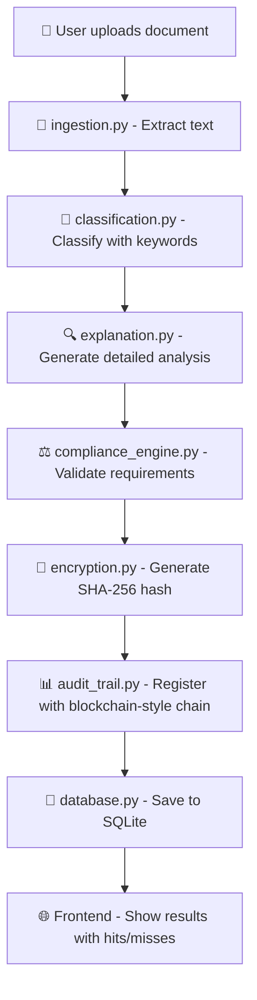

# 📄 Legal Document Classifier

<div align="center">


**Professional system for uploading, classifying and auditing legal documents**

*Combining NLP classification, regulatory compliance, audit trail and security with encryption*

[Installation](#-quick-installation) • [Demo Video](#-demo-video) • [Documentation](#-api-documentation) • [Contribute](#-contribute)

</div>

---

## 🎥 **Demo Video**

🎬 **[Ver Demo Completo en YouTube](https://youtu.be/1x9Y7nYaUzw)**

*Demostración del sistema de clasificación de documentos legales en funcionamiento*

---

## 🎯 **Main Features**

- 🤖 **Intelligent Classification** - Keyword-based categorization with confidence scoring
- 🔒 **Advanced Security** - SHA-256 encryption and file integrity verification  
- 📋 **Regulatory Compliance** - Automatic document validation with detailed explanations
- 🔍 **Complete Audit Trail** - Traceability with chained hash blockchain-style
- 🌐 **Modern Web Interface** - Responsive dashboard with real-time results
- ⚡ **REST API** - Robust endpoints for document management and search
- 🧠 **Explanation Engine** - AI-powered analysis with hits/misses tracking

---

## 🛠️ **System Requirements**

| Component | Required Version |
|-----------|------------------|
| **Python** | 3.10+ |
| **Pip** | Latest version |
| **OS** | Windows / macOS / Linux |

### 📦 Main Dependencies

```bash
fastapi>=0.116.1
uvicorn[standard]>=0.35.0
transformers>=4.55.4
torch>=2.8.0
PyMuPDF>=1.26.4
docx2txt>=0.9
sqlite-utils>=3.38
```

---

## 📁 **Project Architecture**

```
clasificador_docs/
├── 🖥️ back/                          # FastAPI Backend
│   ├── app/
│   │   ├── 📊 audit/                 # Audit system
│   │   │   └── audit_trail.py
│   │   ├── 🧠 classification.py      # Keywords-based classification engine
│   │   ├── ⚖️ compliance/            # Legal validation
│   │   │   └── compliance_engine.py
│   │   ├── 💾 database.py            # SQLite connection and queries
│   │   ├── 📝 demo_dataset.py        # Test data loader
│   │   ├── 🔍 explanation/           # AI explanation engine
│   │   │   └── explanation.py
│   │   ├── 📄 ingestion.py           # Text extraction (PDF/DOCX/TXT)
│   │   ├── 🚀 main.py                # API endpoints
│   │   └── 🔐 security/              # Security utilities
│   │       └── encryption.py
│   ├── 📤 uploads/                   # Uploaded files storage
│   ├── 💾 documents.db               # SQLite database
│   └── 📋 requirements.txt           # Dependencies
├── 🌐 front/                         # Web frontend
│   └── static/
│       ├── index.html
│       ├── script.js
│       └── style.css
└── 📄 .gitignore                     # Git ignore rules
```

---

## ⚡ **Quick Installation**

### 1️⃣ Clone repository
```bash
git clone https://github.com/yourusername/clasificador_docs.git
cd clasificador_docs/back
```

### 2️⃣ Create virtual environment
```bash
python -m venv .venv

# Windows
.venv\Scripts\activate

# macOS/Linux  
source .venv/bin/activate
```

### 3️⃣ Install dependencies
```bash
pip install -r requirements.txt
```

### 4️⃣ Run server
```bash
python -m uvicorn app.main:app --reload
```

🎉 **Ready!** Access: `http://localhost:8000`

---

## 📚 **API Documentation**

### 🔗 Available Endpoints

| Method | Endpoint | Description | Parameters |
|--------|----------|-------------|------------|
| `POST` | `/load_demo/` | Load demo dataset (avoids duplicates) | - |
| `POST` | `/upload_document/` | Upload and classify document | `file` (PDF/DOCX/TXT) |
| `GET` | `/documents/` | Get all documents with pagination | - |
| `GET` | `/list_documents/` | List documents with filters | `category`, `page`, `page_size` |
| `GET` | `/search_documents/` | Search in document content | `query`, `category`, `page`, `page_size` |

### 📤 **Upload Document**

**Request:**
```bash
POST /upload_document/
Content-Type: multipart/form-data
file: [document.pdf]
```

**Response:**
```json
{
  "success": true,
  "document_id": 1,
  "filename": "contract.pdf",
  "category": "contrato",
  "confidence": 0.85,
  "compliance_status": "✅",
  "explanation": "Resumen del análisis de compliance...",
  "cited_articles": ["Art. 1234", "Cláusula 5"],
  "hits": ["contrato", "partes", "firma"],
  "misses": ["vigencia", "penalización"],
  "hash_integrity": "abc123...",
  "created_at": "2025-01-15T10:30:00"
}
```

### 📋 **List Documents with Pagination**

```bash
GET /list_documents/?category=contrato&page=1&page_size=10
```

**Response:**
```json
{
  "success": true,
  "page": 1,
  "page_size": 10,
  "total": 25,
  "total_pages": 3,
  "has_next": true,
  "has_previous": false,
  "documents": [...],
  "message": "Obtenidos 10 documentos de 25 totales"
}
```

### 🔍 **Search Documents**

```bash
GET /search_documents/?query=signature&category=contrato&page=1
```

---

## 🔄 **System Flow**



---

## 🌐 **Frontend Features**

- ✨ **Modern Interface** - Responsive glass-morphism design
- 📊 **Interactive Dashboard** - Real-time classification results  
- 🔍 **Advanced Search** - Content search with pagination
- 📈 **Visual Indicators** - Compliance status and confidence meters
- 🏷️ **Category Filters** - Filter by document types
- 📤 **Drag & Drop Upload** - Intuitive file upload
- 📋 **Detailed Analysis** - Shows hits, misses, and cited articles
- 🔒 **Integrity Verification** - Document hash display

---

## 🔒 **Security and Compliance**

### 🛡️ Security Measures

| Feature | Implementation |
|---------|----------------|
| **File Integrity** | SHA-256 hash verification |
| **Audit Trail** | Chained hash (blockchain-style) |
| **Upload Security** | File extension validation |
| **Data Encryption** | Secure hash generation |

### ⚖️ Legal Validation Categories

- ✅ **Contratos** - General contracts, sales, rental, transfer
- ⚖️ **Sentencias** - Judicial sentences and constitutional court rulings
- 📜 **Escrituras Públicas** - Notarial documents
- 💰 **Documentos Fiscales** - Tax declarations, audits, financial statements
- 🏢 **Documentos Laborales** - Employment contracts and agreements
- 📋 **Actas** - Meeting minutes and official records
- 🏛️ **Administrativos** - Resolutions and administrative acts

---

## 💡 **Differentiating Features**

🔥 **Unique Characteristics:**

- 🔗 **Mini Blockchain** - Immutable audit history with chained hashes
- 🤖 **Keywords Classification** - Fast, explainable classification system  
- 🔍 **Explanation Engine** - Detailed analysis showing hits and misses
- 📊 **Compliance Scoring** - Percentage-based compliance evaluation
- 🎯 **Multi-format Support** - PDF, DOCX, and TXT processing
- 📈 **Confidence Metrics** - Quantified classification confidence

---

## 🚀 **Quick Demo**

### 1. Start the server
```bash
cd back
python -m uvicorn app.main:app --reload
```

### 2. Open web interface
```
http://localhost:8000/front/static/index.html
```

### 3. Load demo data
```bash
curl -X POST http://localhost:8000/load_demo/
```

### 4. Upload a document
```bash
curl -X POST "http://localhost:8000/upload_document/" \
  -F "file=@document.pdf"
```

### 5. Search documents
```bash
curl "http://localhost:8000/search_documents/?query=contrato&page=1"
```

---

## 🎯 **Classification Categories**

The system recognizes the following document types:

| Category | Description | Keywords Count |
|----------|-------------|----------------|
| **contrato** | General contracts | 29 keywords |
| **contrato_traspaso** | Business transfer contracts | 12 keywords |
| **contrato_arrendamiento** | Rental agreements | 14 keywords |
| **contrato_compraventa** | Sale contracts | 13 keywords |
| **escritura_publica** | Notarial documents | 17 keywords |
| **sentencia_judicial** | Court sentences | 22 keywords |
| **sentencia_TC** | Constitutional court rulings | 14 keywords |
| **factura** | Invoices and billing | 25 keywords |
| **acta** | Meeting minutes | 23 keywords |
| **poder_notarial** | Power of attorney | 14 keywords |
| **laboral** | Labor contracts | 25 keywords |
| **fiscal** | Tax documents | 11 keywords |

---

## 🔧 **Development Guide**

### Running the Backend
```bash
cd back
source .venv/bin/activate  # or .venv\Scripts\activate on Windows
python -m uvicorn app.main:app --reload --host 0.0.0.0 --port 8000
```

### Accessing the Frontend
```
http://localhost:8000/front/static/index.html
```

### API Documentation
```
http://localhost:8000/docs          # Swagger UI
http://localhost:8000/redoc         # ReDoc
```

---

## 📊 **Database Schema**

The SQLite database stores:
- **Documents**: ID, title, text, category, confidence, compliance status
- **Metadata**: Creation timestamp, file hash, explanation details
- **Analysis Results**: Hits, misses, cited articles
- **Audit Trail**: Blockchain-style event chain

---

## 🤝 **Contribute**

1. 🍴 **Fork** the project
2. 🌿 **Create** your feature branch (`git checkout -b feature/AmazingFeature`)
3. 💾 **Commit** your changes (`git commit -m 'Add some AmazingFeature'`)
4. 📤 **Push** to the branch (`git push origin feature/AmazingFeature`)
5. 🔃 **Open** a Pull Request

---

## 📝 **Technical Notes**

- **Classification Method**: Keywords-based heuristic approach (not ML model)
- **File Processing**: Supports PDF (PyMuPDF), DOCX (docx2txt), and TXT files
- **Database**: SQLite with full-text search capabilities
- **Security**: SHA-256 hashing for document integrity
- **Frontend**: Vanilla HTML/CSS/JS with modern glass-morphism design
- **API**: FastAPI with automatic OpenAPI documentation

---

<div align="center">

**⭐ If it has been useful, give the repo a star! ⭐**

🎬 **[Watch Full Demo on YouTube](https://youtu.be/1x9Y7nYaUzw)**

*Developed with ❤️ for the legal community*

</div>
